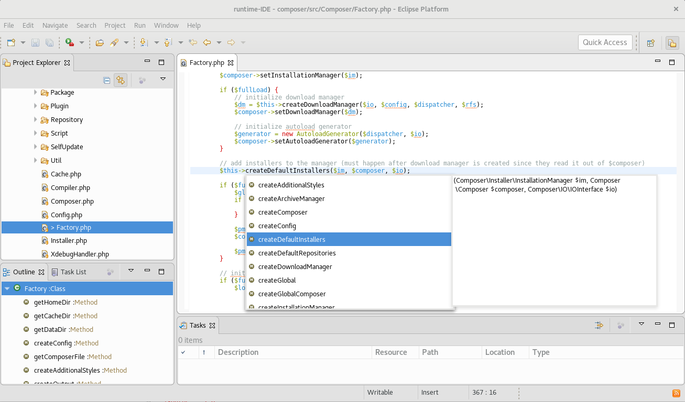

# lsp4e-php

Integration of the PHP Language Server with LSP4E. 

Plugin integrates:
* [LSP4E](https://projects.eclipse.org/projects/technology.lsp4e)
* [tm4e](https://github.com/eclipse/tm4e)
* [PHP Language Server](https://github.com/felixfbecker/php-language-server)

## Installation

Update site: https://dl.bintray.com/kaloyan-raev/lsp4e-php/snapshot/

You need to have 'php' available in your PATH.

The update site is automatically updated by the [Travis CI build](https://travis-ci.org/eclipselabs/lsp4e-php) on every new commit to the master branch.

## Features

* Syntax highlighting
* Code validation
* Completion
* Hyperlinks
* Hovers
* Formatting
* Outline

## Usage

To use features provided by this plugin just open PHP file with **Generic Editor** (_Open With -> Generic Text Editor_).

## Screenshots

