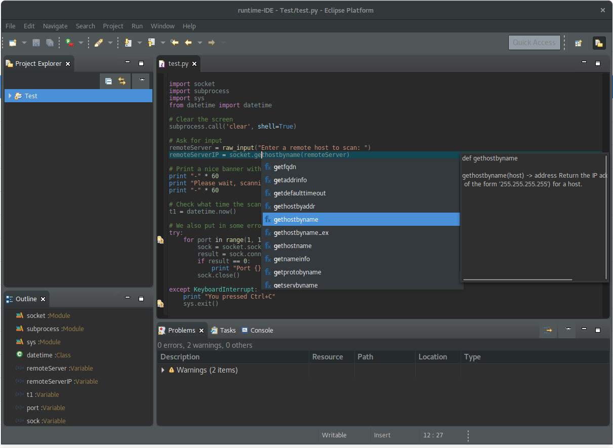

# lsp4e-python

Integration of the Python Language Server with LSP4E. 

Plugin integrates:
* [LSP4E](https://projects.eclipse.org/projects/technology.lsp4e)
* [tm4e](https://github.com/eclipse/tm4e)
* [Python Language Server](https://github.com/palantir/python-language-server)

## Features

* Syntax highlighting
* Code validation
* Completion
* Signature help
* Hyperlinks
* Hovers
* Formatting
* Outline

## Usage

To use features provided by this plugin just open Python file with **Generic Editor** (_Open With -> Generic Text Editor_).

## Screenshots

